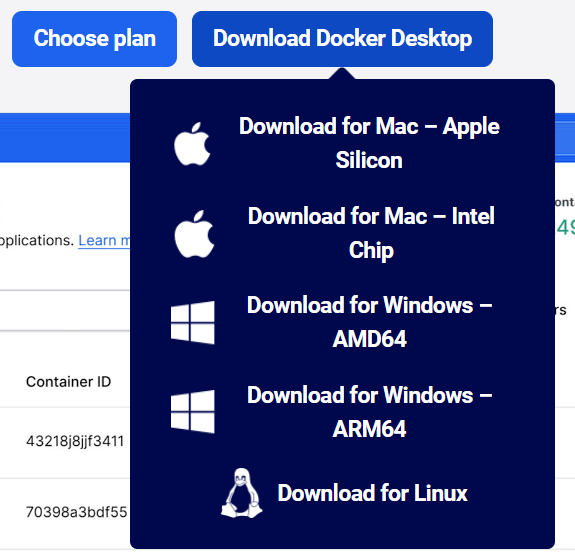

# POSD System

Sviluppo di un’applicazione web che integri ogni elemento della PRIVACY KNOWLEDGE BASE e il mapping esistente tra tali elementi

## ⭐ Obiettivo caso di studio

- ⚔️ Supportare gli sviluppatori nella progettazione e reingegnerizzazione di sistemi orientati alla privacy e sicurezza
- ⚔️ Supportare le aziende nella definizione di processi compliance al GDPR

---

## 📚 Guida all'installazione (step-by-step)

### 🔧 Cosa installare sulla tua macchina

## 1. **Docker Desktop**
- Scarica Docker Desktop dal sito ufficiale:  
  👉 [https://www.docker.com/products/docker-desktop/](https://www.docker.com/products/docker-desktop/)
- Una volta installato, avvialo e assicurati che sia attivo.  
  Verifica la presenza dell’icona della balena **verde** nella traybar per confermare che tutto funzioni correttamente.
  
  

## 2. **Git**
- Scarica Git dal sito ufficiale:  
  👉 [https://git-scm.com/](https://git-scm.com/)
- È necessario per **clonare il progetto** dal repository.

### **Video guida per l’installazione:**
- ▶️ [Git su Windows](https://www.youtube.com/watch?v=iYkLrXobBbA&ab_channel=CodeBear)
- ▶️ [Git su macOS](https://www.youtube.com/watch?v=9GZmaxaQV0c&ab_channel=Codingenthusiast)

3. **Browser moderno** (Chrome, Firefox, Edge ...)

---

## 🚀 Avvio rapido con Docker

- ▶️ [Video Tutorial ](https://streamable.com/rk93fv)

### 🧬 1. Clona il repository
```bash
git clone https://github.com/GiuseppePioDeBiase/Posd_System_Docker.git
cd Posd_System_Docker
```

### ⌨️ 2. Apri Terminale
Apri il terminale nella cartella del progetto clonato

### 🐳 3. Avvia tutto con Docker Compose
```bash
docker compose up --build -d
```

Questo avvia:
- MongoDB con backup 
- Backend Flask (porta `5000`)
- Frontend Vite (porta `5173`)

### 🌐 4. Apri nel browser
- Frontend: [http://localhost:5173](http://localhost:5173)
- Backend: [http://localhost:5000](http://localhost:5000)

### 🔚 5. Chiudere tutto
Quando vuoi spegnere i container:
```bash
docker compose down
```
Questo fermerà tutti i servizi in modo sicuro.

---

## 🛠️ Struttura del progetto
```
POSD_System/
├── backend/
├── frontend/
├── backup/              # Dump MongoDB
├── docker-compose.yml
```

---

## ⚙️ Approfondimento tecnico: Dockerfile e docker-compose.yml

👉 [Leggi il README tecnico](docs/README_TECNICO.md)

---

## 👤 Credenziali primo accesso (Amministratore)


🔐 Durante la registrazione sarà obbligatorio inserire una password che:
- contenga una **lettera maiuscola**, una **minuscola**, un **numero** e un **carattere speciale**
- sia lunga almeno **8 caratteri**

---

## 🎨 IDE & Strumenti

<code></code>
<code></code>
<code></code>

---

## 🎓 Frameworks e Librerie

<code></code>
<code></code>
<code></code>
<code></code>
<code></code>

---

## 💍 Crediti

Sviluppato da:

- [@GiuseppePioDeBiase](https://github.com/GiuseppePioDeBiase)
